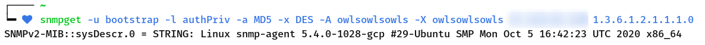

# SNMP

Fulgte [denne guiden](https://www.digitalocean.com/community/tutorials/how-to-install-and-configure-an-snmp-daemon-and-client-on-ubuntu-18-04)

Diverse screenshots:





# RADIUS

Fulgte [denne guiden](https://techexpert.tips/no/nginx-no/nginx-radius-godkjenning/) for oppsett, men noen vesentlige avvik oppsto:

+ Gammel versjon av `systemd`, feil kommando for mitt system
+ Måtte kjøre skriptet `bootstrap` fra `/etc/raddb/certs/` for å generere sertifikater
  + Ellers ville ikke `radiusd` starte
  + Guiden foreslo å kjøre `radiusd -CX` _etter_ å ha restartet `radiusd` – 
    dette var en mildt sagt dårlig idé da `systemd`-uniten kjører `radiusd -C` som ikke gir noen output ved feil i konfigurasjonsfila.

## Testing

Kjørte `radtest bob hello localhost 0 testing123`, fikk følgende til svar

```
Sent Access-Request Id 98 from 0.0.0.0:53651 to 127.0.0.1:1812 length 73
	User-Name = "bob"
	User-Password = "hello"
	NAS-IP-Address = 192.168.0.193
	NAS-Port = 0
	Message-Authenticator = 0x00
	Cleartext-Password = "hello"
Received Access-Accept Id 98 from 127.0.0.1:1812 to 127.0.0.1:53651 length 40
	Reply-Message = "Konichiwa, bob-san"`
```

Kjørte `radtest admin asdfman localhost 0 testing123` og fikk godkjenning da også

## NGINX

Hadde en NGINX-server kjørende på en stasjonær PC.

## Never mind

Jeg kjørte alt via Google Cloud fordi ting bare ikke funka.

Se vedlagte screenshots osv.

Ting avvek ikke lenger fra tutorialen siden systemet nå var mer likt.


