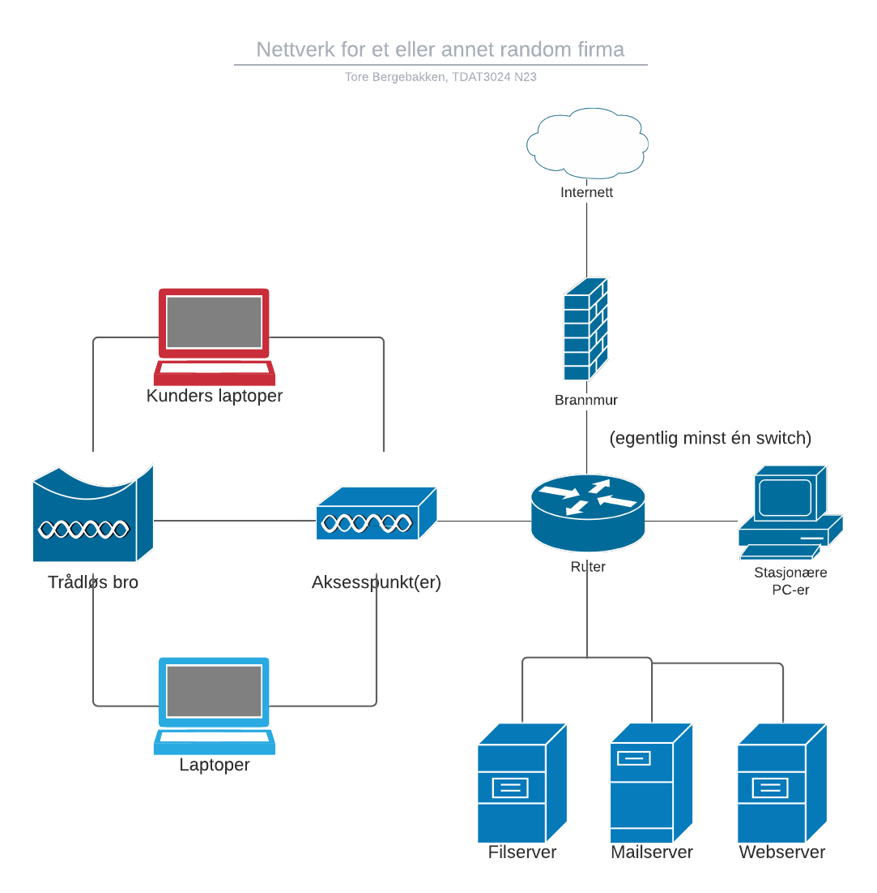
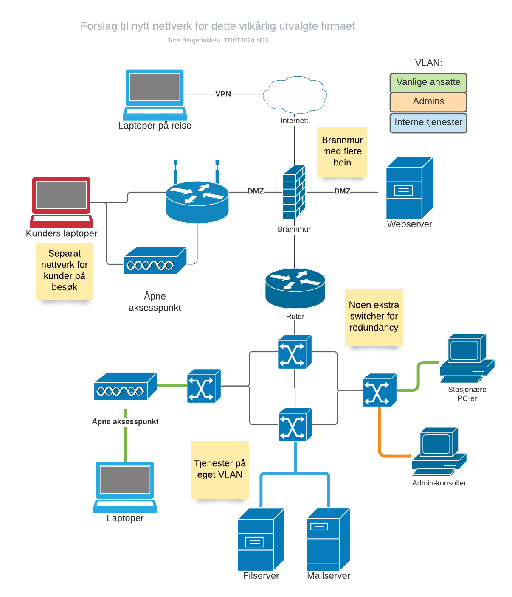

# Oppgave 1

## Multiconsult

Skulle lese en [artikkel i Teknisk ukeblad](https://www.tu.no/artikler/her-stjeles-sjtokman-data-fra-multiconsult/238345)

Oppsummert: Tyver brøt seg inn og stjal fire PC-er. Securitas kom først etter fem minutter, da var de fordunstet. Om PC-ene inneholdt sensitiv informasjon er uvisst.

### a) Hva kunne de gjort for å forhindre at dette skjedde?

Ha egne vakter som sjekker viktige steder ofte. Be Securitas ha raskere beredskap, siden dette kan være et attraktivt mål.

Forbedre sikkerheten til dørene i bygget. Det fins folk som kan gjøre fysiske penetrasjonstester, det kan gi nyttige resultater. Ut fra bildet av låsen på denne døra, ser den ikke spesielt sikker ut.

### b) Hvilke skademinimerende tiltak kunne vært nyttige?

Kryptert filsystem på harddiskene til alle PC-er.
Ja, det kan ta litt lengre tid å starte opp, og det blir et ekstra passord som _må_ huskes, men sikkerhetsgevinsten er enorm (såfremt passordene er lange nok og krypteringen er god).

## Barclays

Skulle lese en
[Silicon-artikkel](https://www.silicon.co.uk/workspace/barclays-kvm-hacked-arrests-127565)
og en
[slashdot-tråd](https://yro.slashdot.org/story/13/09/21/0030216/another-british-bank-hit-by-kvm-crooks)

Oppsummert: Hackere infiltrerte en bank og koblet opp en enhet til et aksesspunkt. De fikk tilgang til den utenfra og stjal penger.

### a) Hva kunne de gjort for å forhindre at dette skjedde?

Noen kunne ha fattet mistanke. Noen kunne ha spurt om å få se informasjon om personens stilling e.l. – og det kunne vært rutine for å si fra om teknisk vedlikeholdsarbeid _på forhånd_, slik at en uplanlagt reparasjon ville virke _særdeles_ mistenkelig.

Dessuten: Det kunne vært lagt inn sperrer i brannmur e.l. for å sørge for at  enheter som er tilkoblet mer tilgjengelige aksesspunkter som dette, _ikke_ skal ha mulighet til å utføre slike enorme overføringer.

### b) Hvilke skademinimerende tiltak kunne vært nyttige?

Ha et eller annet system på plass for å kunne _trekke tilbake_ en transaksjon?

Sørge for at all trafikk gjennom enheter som det 3G-aksesspunktet blir logget?

# Oppgave 2

Jeg kan ta et personlig problem:  
ISP-en som leverer nettet til familiehjemmet tilbyr også epostadresser. Jeg har brukt en slik adresse som min offisielle epost i mange år nå, gjennom tredjepartsklienten Thunderbird. Nylig fant jeg ut at pakkene med epost sendt _fra_ meg, ikke er kryptert når de sendes ut fra min maskin. Etter en telefonsamtale med kundestøtten ble jeg satt over til en mer teknisk kyndig person, som kunne forklare at _jo_, pakkene _blir_ kryptert, men det skjer først når pakkene passerer _en av ISP-ens egne rutere_. Nå som jeg har flyttet hjemmefra og ikke har en ruter fra denne ISP-en, er det altså direkte utrygt å bruke Thunderbird eller andre epostprogrammer til å sende eposter fra denne adressen.

Dette har altså ikke forårsaket noe sikkerhetsbrudd _til nå_ – men å sende informasjon over en kanal du i utgangspunktet _tror_ du kan stole på at er kryptert, når det viser seg at den ikke er det ... Dette kunne blitt ganske ille.

For å unnga dette problemet, ville jeg _enten_ sørget for at utsendt epost kunne bli kryptert i tredjepartsprogrammer _eller_ si fra klart og tydelig at å bruke slike programmer bare ville være trygt hvis trafikken blir sendt gjennom en av denne ISP-ens rutere.

# Oppgave 3

## Problemer og tiltak

> Gjør rede for alle problemer du ser. Ledelsen er med på sikkerhetstiltak, men de er såpass oppegående at de vil vite «hvorfor».

> Gjør rede for sikkerhetstiltak, forandringer og nytt utstyr/programvare. Tegn opp hvordan du mener det nye nettet bør være. Det er fint om eksisterende måter å bruke nettet kan føres videre, men selvfølgelig på en sikrere måte enn i dag.

**NB:** Ledelsen vil vite **hvorfor**.

Skriver dette som punktliste da det er oversiktlig nok og jeg ikke har all verdens til til å jobbe med denne øvinga.

Krav til løsningen(e):
  + Ikke tungvint
  + Ikke føre til ekstra arbeid
  + Ikke føre til store faste utgifter
    + Engangsinnkjøp er ok

Problemer og mulige tiltak:

+ Informasjon har lekket til en konkurrent
  + Innbrudd er sannsynligvis enkelt
  + Er kommunikasjon kryptert i det hele tatt?
    + Det presiseres ikke
  + Er nettet sikret på noen som helst måte?
    + Ja, med brannmur, men den gjør ikke all verdens
    + ...men kunder på besøk har tilgang til firmanettet.
      Da kan de også snoke rundt i filserveren og andre interne tjenester som de vil.
      → jeg tror vi har den mest sannsynlige grunnen til lekkasje her.
+ Felles ruter og switch for _alle_ enheter!
  + Dette er en _særdeles_ dårlig idé. IT-folk trenger mer inngripende tillatelser enn andre ansatte, resten av firmaet bør _ikke_ ha tilgang til alt administratørene har tilgang til!
  + Del opp nettverket i separate nettverk/VLAN,
    helst med en ekstra brannmur inn mot sårbare enheter
  + Med flere VLAN vil rettigheter kunne skilles i større grad
    + Admins kan ha tilgang til _konfigurasjon_ av ruter og switch
    + Vanlige ansatte kan ha tilgang til filserver, epostserver, VPN osv.
+ Ingen vet hvordan brannmuren virker
  + Dette gir dårlig mulighet for feilsøking og vedlikehold
  + Brannmuren er pga. dette ingen virkelig sikkerhetsgaranti, den er et ukjent moment
  + Skaff informasjon (noen som kan sakene sine)
  + Finn ut hvordan den er konfigurert -- skrot den hvis den ikke er god nok
+ Kunder har adgang til _samme trådløse nett_ som de ansatte
  + Lag et _separat_ gjestenett med grei beskyttelse
  + Helst med en brannmur _innenfor_ ruteren som gjestenettet går innom
  + En trådløs bro er satt opp (utstyr laget for å overføre data mellom to _spesifikke_ punkter (kanskje et AP) trådløst)
+ Alle maskinene har egen IP
  + Er dette en lokal IP eller en _faktisk ekstern IP_?
  + Hvis det siste stemmer, sett opp NAT-ing, så trenger ikke PC-ene få problemer med å _potensielt_ være eksponert for nettet.
+ Mye reising, data ligger i skyen (Dropbox)
  + Er dette et privat Dropbox-abonnement?
  + Hva slags kontroll har bedriften over informasjonens ivaretagelse?
  + Bruk heller en self-hosted skyløsning, om mulig
    + **NB:** Kan lede til betydelig mer vedlikeholdsarbeid
  + Sett opp et VPN for tilgang til bedriftens tjenester utenfra
    + Da kan en intern filserver brukes istedenfor Dropbox
    + En VPN skal ikke medføre _så_ mye mer infrastruktur å vedlikeholde
    + De ansatte vil fortsatt kunne reise og jobbe utenfor bedriftens `n` vegger
  + Spesielt ille er det at _kontraktforslag_ ligger på Dropbox
+ Bob sender dropbox-lenker fordi det er lett. Antar han sender lenke til _mappa med alle brosjyrene_, uvisst om sensitiv info ligger der
  + **Ikke** legg sensitiv info i ei mappe i skyen som deles med kunder
    + Fra forrige punkt vet vi at de ansatte har _kontraktforslag_ i skyen, dette kan _meget vel_ inneholde sensitive opplysninger om klienter og bedriften selv
  + Gir lenka endringstilgang? I så fall, stopp umiddelbart
  + Han gjør det fordi filserveren er treg. Finn en annen løsning for deling av brosjyrer med kunder.
  + Hva slags filserver er dette? Er den beskkyttet? Inneholder den sensitiv info?
    + Siden dere _har_ en filserver, kunne den forbedres heller enn å la ansatte støtte seg til en ekstern skytjeneste?
    + Bob klager over at den er treg – det kan virkelig være på tide å skaffe en ny og bedre enhet. Nei, den er ikke gammel, men den er _lang fra god nok_.

{ width=250px }

+ Er mailløsningen deres sikret på noen som helst måte? Er det en tredjeparts-eposttjeneste som brukes?
+ Vannlekkasje fra etasjen over serveren
  + Flytt serveren så den ikke står under _varmtvannstanken_ av alle ting
  + Regnskap tapt → ta regelmessig backup!
    + Papir var lagret, kvitteringer og bilag brukt til rekonstruksjon
    + Sørg for å ha digital backup på separat(e) maskin(er).

## Forslag til nytt nettverketsoppsett

Først en illustrasjon av det opprinnelige nettverket:

Så, mitt forslag til nytt nettverk:

## Sikkerhetspolicy

> Lag et kort utkast til en sikkerhetspolicy, og fortell om hva du vil kurse de ansatte i, angående nettsikkerhet.

+ Servere skal ikke plasseres i nærheten av eller under beholdere med vann.
+ All formidling av kontrakter og brosjyrer skal foregå via den _interne_ filserveren (eller _spesifikke_ lenker til filer i en _beskyttet_ skytjeneste).
  + Ikke del ut lenker til en åpen Dropbox-mappe med kontraktforslag og brosjyrer.
+ Ta regelmessig backup _og sørg for at det er lett å gjenopprette backup_.
+ Når ansatte er på reise, skal de benytte VPN for å kommunisere med interne tjenester.
  + Ingen sensitive opplysninger skal ligge på (ukryptert) disk i en laptop som tas med utenfor bedriftens lokaler.
+ Kunder og andre utenforstående skal _ikke_ ha tilgang til det interne nettet – forvis dem til gjestenettet.
+ Ta en årlig revurdering av sikkerhetspolicyen – vurder nye tiltak kontinuerlig.
  + Ta spesielt godt tak i tilfeller der de ansatte bryter forskriftene fordi _det er vanskelig for dem å følge dem_ – da *kan* forskriftene endres, men isteden bør løsningene forbedres slik at det blir mer attrakt for de ansatte å bruke dem (f.eks. raskere filserver (innen rimelighetens grenser)), eller de ansatte det gjelder kan formanes om å følge dem.

## Kursing

+ Sensitiv informasjon kan komme på avveie
  + Deler du ei lenke til ei Dropbox-mappe, kan alle som får lenka inspisere alt som ligger der
  + Dette gjelder også konkurrentene!
+ Hva er en brannmur, hvordan er denne _nye_ brannmuren satt opp, og hva slags regler er satt på den?
+ Hvordan setter vi opp et VLAN, og hvordan må det oppdateres?
+ Opplæring i å sjekke innholdet i loggfiler (eller andre, mer brukervennlige framstillinger)
+ Bruk av VPN

## Brannmur-regler

> Gjør rede for hvilke regler du vil ha i brannmuren. Hver brannmur-regel skal begrunnes, med en kort forklaring på hvorfor den hjelper.

Konkrete forslag til regler er skrevet med UFW-syntaks, siden den er relativt lettlest. Jeg skriver ikke så mange av dem nå.

+ Regel for NAT så bedriften kun har en/noen få offentlig(e) IP-adresse(r), og maskinene på det interne nettet faktisk har lokale IP-er.
+ Ingen tilkoblinger utenfra skal ha tilgang til tjenester på det interne nettet -- men tilgang via VPN skal være lov.
  + `ufw default deny incoming`
  + `ufw allow in 1194/udp comment "Allow VPN traffic"`
+ Webserveren (som jeg regner med at bedriften har, siden "ødelagte websider" er nevnt) skal også være tilgjengelig utenfra. Det samme gjelder eventuelle andre tjenester i DMZ.
  + Spesifikk regel for port 443 (HTTPS) til webserveren
  + Uten et slikt unntak vi ikke andre enn bedriftens ansatte se nettsida.
+ Ansatte skal ikke ha tilgang til administrasjon av enheter som servere, rutere, brannmurer osv.
  + Begrens tilgang til RADIUS-server o.l. med regler som filterer subnett (forskjellige VLAN).
  + Hvorfor? De ansatte skal jo ikke trenge å konfigurere nettverksenheter hvis de ikke har ansvar for nettopp dette utstyret. Principle of least privilege.
