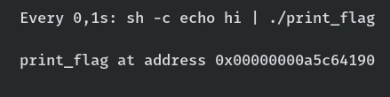

# 1 Buffer overflow

## 1.1

Bufferen er 64 byte lang, systemet er 64-bits → 8 byte per adresse.
Etter bufferen og før returadressen har vi en 8-bytes adresse, RBP.
Da trengs $64 + 8 = 72$ A-er for å overskrive buffer og EBP. Begynnelsen av returadressen følger rett etter, den er også 8 bytes lang.

## 1.2

Ser at `0x401163` inneholder et kall til `puts` og `0x40115c` gjør noe med et array som er relatert til IO. Et tilsvarende sett av instruksjoner står fra `0x401146`. `0x40115a` er en hopp-instruksjon Jeg konkluderer med at `0x40115c` er starten på printf-kallet inne i if-blokka, og det er _dit_ vi vil hoppe for å passere if-testen.

Se [print_flag.py](print_flag.py) for en fungerende exploit. Demo:

```sh
make pie
python print_flag.py
python print_flag.py dyn
```


## 1.3

Vi får alle 16 heksadesimale sifre i adressen til `print_flag`. Vi kjenner assembly-koden og dermed offsetet vi må ha fra starten av `print_flag`. Ergo trengs bare én gjennomkjøring for å få printet `print_flag`.

Dette viste seg å være feil. _Jeg vet ikke hvorfor_.

En test med `watch` viser at _kun_ de fem sifrene før de tre siste endrer seg.
Hvert siffer kan innta 16 forskjellige verdier. Da har vi $16^5$ muligheter å sjekke.



Tekstsegmentet i en executable vil alltid ligge på _lave_ minneadresser.

# 2 Autentisering

## 2a)

Når passord sendes over for registrering og innlogging:

1. Hash passordet på klientsiden. Bruk brukernavn og eventuelle andre _faste_ data som salt.
2. Hash passordet på serversiden. Bruk en tyngre algoritme med nøkkelekspansjon. 
  + Hvis registrering: Salt med en _tilfeldig generert streng_. Lagre hash og salt i databasen.
  + Hvis pålogging: Hent saltet fra databasen. Hash det tilsendte passordet og sjekk mot hashen i databasen. Hvis de stemmer overens, kan brukeren logges inn.
3. Ved innlogging kan du gjerne bruke et token av et slag. Generer det og send det tilbake. La utløpstida være på noen minutter og lag et nytt token for (stort sett) hvert nye kall til serveren, eller sørg for at klienten ber om et nytt token med jevne mellomrom.

## 2b)

Jeg vil fjerne denne informasjonen ved å legge inn en eksplisitt, ugjendrivelig overskriving av minneområdet som inneholder passordet. Denne må for all del ikke optimaliseres vekk av kompilatoren.

(TODO)

## 2c)

Feilene:

+ Evig løkke hvis inputen ikke inneholder både bokstav og tall.
+ Aksessering av minneområde utenfor strengen hvis strengen ikke inneholder både bokstav og tall.

`libFuzzer` genererer masse tilfelig input og sender det inn i funksjonen som testes. Hvis en feil oppstår (å aksessere lengre ut i en streng enn det som fins i den, gir en kjøretidsfeil i C++) vil `libFuzzer` rapportere om den, med base64-versjon av inputen som fikk funksjonen til å feile.

Tilleggsinfo: Biblioteket har som mål å utforske flest mulig av veiene gjennom koden. Hvis fuzzeren finner en vei den ikke har gått før, vil den forsøke å lage varianter av inputen som fikk koden til å gå den veien.

# 3 Affine chiffer

# 4 Hashfunksjoner

# 5 Primtallsfaktorisering

# 6 Script I

Regner med at `find`-kommandoen skulle slutte med `\;`. Da er `{}` _ett_ filnavn.

Skriptet søker etter `docx`-filer _med et spesifikt navn_ i rotmappa (`/`) og tar en kopi av dem (med filetternavnet `.backup`). Så rapporterer den om at `brukernavn` kopierte `filfornavnet` til slutten av en loggfil kalt `script.log`.

# 7 Script II

`-print0` gjør at outputen til `find` separeres med `null`-bytes istedenfor linjeskift.

`-0` gjør at `xargs` leser inn argumenter separert med `null`-bytes istedenfor linjeskift.

Dette gjør at find-output som _tilfeldigvis_ har linjeskift i seg, ikke ødelegger utførelsen av pipelinen. Vi vil jo at _alle_ filnavnene som matcher `find`-kommandoen skal brukes i `xargs`, selv om de er laget av folk som absolutt må slenge inn `\n` i filnavnene sine.

# 8 Brannmur

Et pakkefilter ser på felter (og evt. større sammenhenger mellom pakker sendt i forb. med samme tilkobling) etter visse kriterier (regler) og avgjør om pakker skal rutes videre eller forkastes (med eller uten tilbakemelding – REJECT vs. DROP i `iptables`).

Eksempel: Forkast alle pakker utenfra som sendes til andre porter enn 80 på den interne webserveren. Avvis (reject) alle pakker innenfra som går til Facebooks nåværende IP-adresse(r) eller til portnummer 25565 på en ekstern server (Minecraft i arbeidstida? Fy fy).

# 9 Case

yes yes
